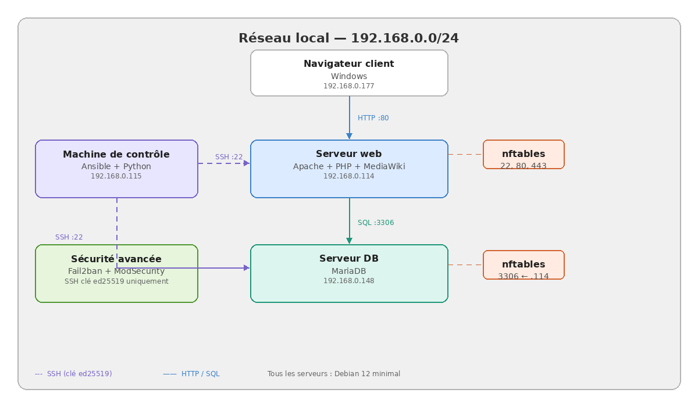

# Projet MediaWiki - Déploiement automatisé avec Ansible

Projet en deux parties réalisé dans le cadre du cours Administration de Serveurs Internet. L'objectif était de contraster le durcissement manuel d'un serveur Linux avec l'automatisation déclarative du déploiement d'une application multi-serveurs.

La **Partie 1** sécurise un serveur Debian 12 : Apache2 avec TLS, authentification par clé SSH, pare-feu nftables avec suivi d'état, prévention d'intrusion avec Fail2ban et ModSecurity comme pare-feu applicatif.

La **Partie 2** utilise Ansible pour déployer une application MediaWiki à 2 niveaux sur deux serveurs Debian : un exécutant Apache + PHP, l'autre MariaDB. Le playbook est idempotent et organisé en rôles réutilisables.

## Architecture



Trois machines virtuelles Debian 12 sur le sous-réseau `192.168.x.0/24` :

- `ansible-control` : Nœud de contrôle Ansible 
- `srv-web` : Apache + PHP + MediaWiki
- `srv-db` : MariaDB hébergeant `wikidb`

Voir [ARCHITECTURE.md](ARCHITECTURE.md) pour les détails complets sur les flux réseau, les ports et les frontières de confiance.

## Compétences démontrées

- Durcissement de serveur Linux sur Debian 12 minimal
- Configuration TLS d'Apache 2.4 (certificat auto-signé, en-têtes de sécurité) 
- Durcissement SSH : clés ed25519, login root désactivé, auth par mot de passe désactivée
- Pare-feu à états (nftables) avec `policy drop` et liste blanche sélective
- Prévention d'intrusion avec Fail2ban sur backend systemd
- Pare-feu applicatif : ModSecurity 3 + OWASP Core Rule Set
- Infrastructure as Code avec Ansible (rôles, handlers, templates)
- Templates Jinja2 pour la configuration spécifique à l'hôte
- Idempotence du playbook et détection de dérive 
- Résolution de variables inter-hôtes (`hostvars`)

## Structure du dépôt

```
.
├── README.md                 
├── ARCHITECTURE.md           Réseau + frontières de confiance      
├── architecture.png          Diagramme
├── part1-hardening/          Guide de durcissement manuel + fichiers de config
├── part2-ansible/            Projet Ansible (playbook, rôles, inventaire)
└── docs/
    ├── journal-erreurs.md    Erreurs réelles rencontrées + résolutions
    └── lessons-learned.md    Réflexion sur ce que ce projet m'a appris
```

## Démarrage rapide (Partie 2 - Déploiement Ansible)

```bash
# Sur le nœud de contrôle Ansible  
cd part2-ansible

# Copier les fichiers d'exemple et renseigner les vraies valeurs
cp inventory.example.ini inventory.ini
cp group_vars/all.example.yml group_vars/all.yml

# Installer les collections requises (versions épinglées pour Ansible 2.14)
ansible-galaxy collection install 'community.general:<8.0.0'  
ansible-galaxy collection install 'community.mysql:<4.0.0'

# Vérifier la connectivité
ansible mediawiki -i inventory.ini -m ping

# Exécuter le playbook
ansible-playbook -i inventory.ini site.yml  
```

Les hôtes cibles doivent être accessibles par authentification par clé SSH, avec l'utilisateur Ansible configuré pour sudo `NOPASSWD`.

## Considérations de sécurité

**Secrets** — Les vrais `inventory.ini` et `group_vars/all.yml` ne sont pas suivis (voir [.gitignore](.gitignore)). Seules des versions `.example` assainies sont commitées. En contexte de production, ils seraient chiffrés avec Ansible Vault plutôt que conservés en fichiers plaintext.

**Certificats auto-signés** — La Partie 1 utilise un certificat TLS auto-signé pour la démonstration ; en production, Let's Encrypt ou une AC commerciale serait utilisée. 

**Pas de HTTPS sur le vhost MediaWiki** — La Partie 2 déploie MediaWiki sur le port 80 uniquement, pour garder l'accent sur les concepts d'automatisation. Ajouter un vhost TLS est une extension naturelle qui réutiliserait les modèles de la Partie 1.

## Artefacts de documentation

Le rapport complet du projet (en français) incluant la procédure détaillée, le raisonnement sur l'architecture et les captures d'écran du déploiement en direct est disponible sur demande.

## Licence 

Ce projet est publié à des fins éducatives et de portfolio.
